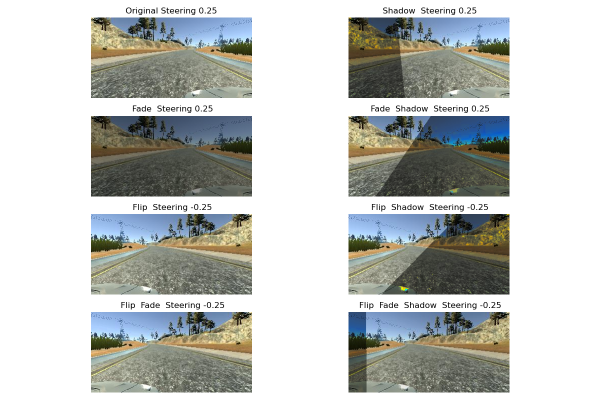

# Behavioral Cloning for Autonomous Driving

In this project I'll train a Convolutional Neral Network to drive a car in the Udacity's Simulator. The main idea is to copy main driving style.


## Personal goal

I want to learn more about modern Keras. In this project I won't use the Udacity's Workspace. I'll use:

* Keras 2.4.3
* TensorFlow 2.4.1
* The latest version of the Simulator from sources
* The model and the test must be usable on the low-power laptop with GPU:
  * Quadro P2000 computeCapability: 6.1
  * coreClock: 1.607GHz
  * coreCount: 6
  * deviceMemorySize: 4.00GiB
  * deviceMemoryBandwidth: 89.53GiB/s

#### Note:
**The most challenging part of the project was the environment. I've got precious experience setting it up.**

## Steps of the project

* Collect data with simulator. I drove 15 laps in both directions with 5 recovery laps for each direction
* Build with Keras the [DAVE-2 CNN by Nvidia](https://developer.nvidia.com/blog/deep-learning-self-driving-cars/)
* Train and validate the model with augmented training set
* The car must not leave the track

---
## Project structure

* `model.py` contains the definition of the model and training
* `frame.py` contains the Object Oriented model of frames. Frame is a set of three images captured by the left, center and right cameras
* `drive.py` and `video.py` are provided by Udacity
* `model.h5` is the trained CNN
* `generator.py` contains the generator for testing and validation sets. It loads frames and applies an augmentation if needed
*  `video.mp4` is the resulting video
*  `data_import.py` contains the code which loads data

---
## The Model

### Model architecture

The basic idea is similar to Nvidia's DAVE-2 model, but there're some changes:
* The first layer normalizes the input. All pixels values are in the range [-1, 1]. The layer implemented with keras.layers.Lambda
* The next layer (keras.layers.Cropping2D) crops the image by 60 pixels from the top and by 25 pixels from the bottom
* Next layers are identical to DAVE-2
* The model compiled with the Mean Squared Error loss function and Adam optimizer  for the gradient

Summary of the model:

```
Model: "DAVE2"
_________________________________________________________________
Layer (type)                 Output Shape              Param #
=================================================================
Normalization (Lambda)       (None, 160, 320, 3)       0
_________________________________________________________________
cropping2d (Cropping2D)      (None, 75, 320, 3)        0
_________________________________________________________________
conv2d (Conv2D)              (None, 36, 158, 24)       1824
_________________________________________________________________
conv2d_1 (Conv2D)            (None, 16, 77, 36)        21636
_________________________________________________________________
conv2d_2 (Conv2D)            (None, 6, 37, 48)         43248
_________________________________________________________________
conv2d_3 (Conv2D)            (None, 4, 35, 64)         27712
_________________________________________________________________
conv2d_4 (Conv2D)            (None, 2, 33, 64)         36928
_________________________________________________________________
flatten (Flatten)            (None, 4224)              0
_________________________________________________________________
dense (Dense)                (None, 100)               422500
_________________________________________________________________
dense_1 (Dense)              (None, 50)                5050
_________________________________________________________________
dense_2 (Dense)              (None, 10)                510
_________________________________________________________________
dense_3 (Dense)              (None, 1)                 11
=================================================================
Total params: 559,419
Trainable params: 559,419
Non-trainable params: 0
_________________________________________________________________
```

## Preparing Data

The training set consists of images of the Lake Track. I drove the car 15 laps in both directions – counter- and clockwise and data stored in two datasets. Each dataset also contains “recovery” data – the last five laps in each direction.
I used sklearn.model_selection.train_test_split according to the Pareto principle – 80% for training and 20% for validation to split the data.

Data organized as frames. Each frame has 3 images from the left, right and center cameras. It means the total number of samples must be multiplied by three.

Because I use the laptop with limited resources, I used small batches of size 32.

The generator includes each frame twice – with the augmentation and without.

```
Number of training frames: 41122
Number of validation frames: 10281
Number of training samples: 246732
Number of validation samples: 61,686
Number of training steps: 1286
Number of validation steps: 322
```

## Data Augmentation

Each frame from the training set randomly augments its images. The augmentation depends on a randomly generated vector of boolean values. Each value in the vector determines whether or not the augmentation will be used:

* Flip the image
* Fade the image
* Use randomly created shadows

Here some examples of the augmented images:



## Results

Even with this simple CNN, the car learns the behavior entirely accurately. I’m planning to use one of the pre-trained networks from Keras, such as Inception, VGG, or ResNet. These networks might get better results, but also they need more resources.

For a real car, it’s not enough, though. We need to fuse the data from cameras with sensors.

Let's look from the 3rd person view:


